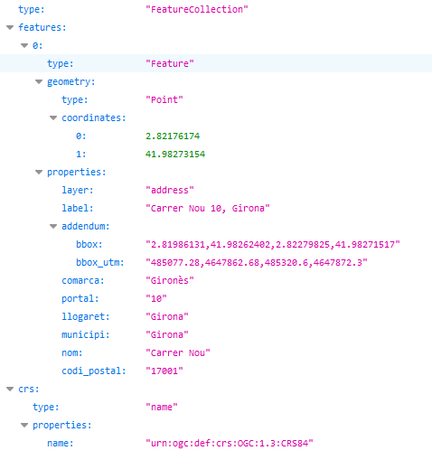

# 1.1 Buscar una dirección postal 

Hay que indicar la dirección a buscar en el parámetro **text**.

Por ejemplo, indicando *nou 10,girona*, obtenemos las coordenadas geográficas de la dirección postal **Carrer Nou 10, Girona**: 2.82176174, 41.98273154: 
[https://eines.icgc.cat/geocodificador/autocompletar?text=*nou 10,girona*&size=1&layers=address](https://eines.icgc.cat/geocodificador/autocompletar?text=nou 10,girona&size=1&layers=address){target="_blank"}

El resultado es:

