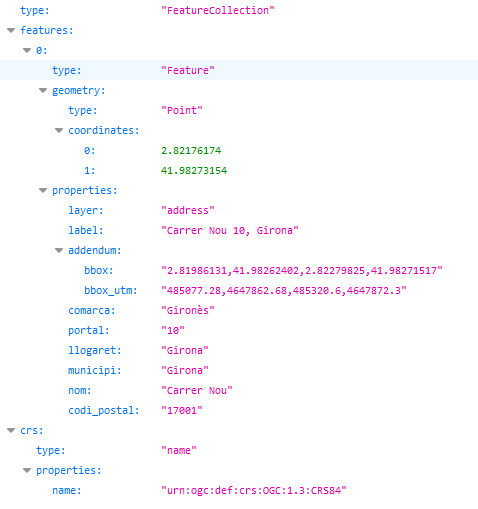

# 1.1 Cercar una adreça postal 

Cal indicar l'adreça a cercar en el paràmetre **text**.

Per exemple, indicant **nou 10,girona**, obtenim les coordenades geogràfiques de l'adreça postal **Carrer Nou 10, Girona**: 2.82176174, 41.98273154

[https://eines.icgc.cat/geocodificador/autocompletar?text=**nou 10,girona**&size=1&layers=address](https://eines.icgc.cat/geocodificador/autocompletar?text=nou 10,girona&size=1&layers=address)

El resultat és:

