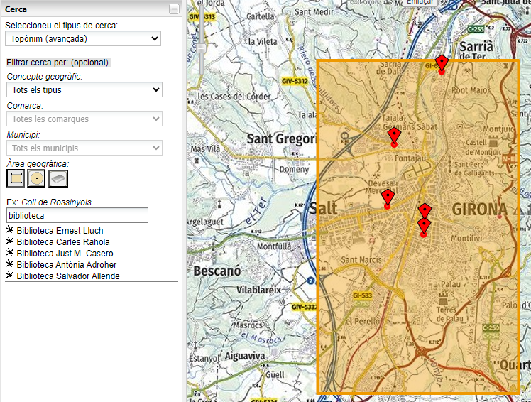

# 1.8 Restringir la búsqueda dentro de una área geográfica circular o rectangular
En la imagen se muestra la aplicación [Vissir](http://srv.icgc.cat/vissir3/){target="_blank"}, donde se ha hecho una petición al geocodificador para obtener los topónimos que contienen el texto **biblioteca** con coordenadas dentro del rectángulo indicado.

Una petición ejemplo es la siguiente, donde se indican el texto a buscar en el parámetro **text** y las coordenadas del rectángulo en los parámetros **boundary.rect.***: 

[https://eines.icgc.cat/geocodificador/autocompletar?*text=biblioteca*&layers=topo1,topo2&size=300*&boundary.rect.min_lon=2.790885602127&boundary.rect.min_lat=41.951744582496&boundary.rect.max_lon=2.847448636407&boundary.rect.max_lat=42.012358869945*](https://eines.icgc.cat/geocodificador/autocompletar?text=biblioteca&layers=topo1,topo2&size=300&boundary.rect.min_lon=2.790885602127&boundary.rect.min_lat=41.951744582496&boundary.rect.max_lon=2.847448636407&boundary.rect.max_lat=42.012358869945){target="_blank"}

