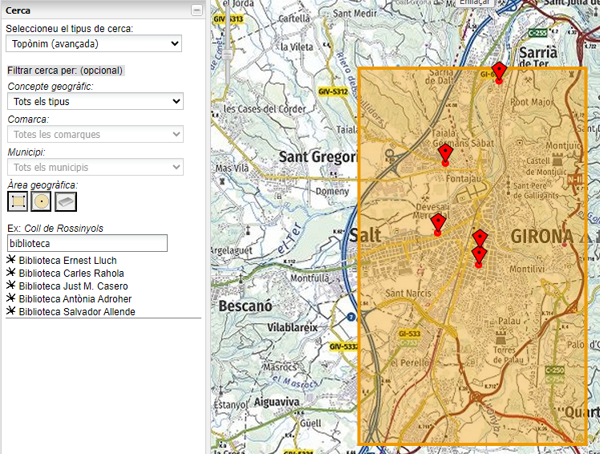

# 1.8 Restringir la cerca dins una àrea geogràfica circular o rectangular
A la imatge es mostra l'aplicació [Vissir](http://srv.icgc.cat/vissir3/){target="_blank"}, on s'ha fet una petició al geocodificador per a obtenir el topònims que contenen el text **biblioteca** amb coordenades dins el rectangle indicat.

Una petició exemple és la següent, on s'indiquen el text a cercar al paràmetre **text** i les coordenades del rectangle als paràmetres **boundary.rect**: 

[https://eines.icgc.cat/geocodificador/autocompletar?**text=biblioteca**&layers=topo1,topo2&size=300**&boundary.rect.min_lon=2.790885602127&boundary.rect.min_lat=41.951744582496&boundary.rect.max_lon=2.847448636407&boundary.rect.max_lat=42.012358869945**](https://eines.icgc.cat/geocodificador/autocompletar?text=biblioteca&layers=topo1,topo2&size=300&boundary.rect.min_lon=2.790885602127&boundary.rect.min_lat=41.951744582496&boundary.rect.max_lon=2.847448636407&boundary.rect.max_lat=42.012358869945){target="_blank"}

