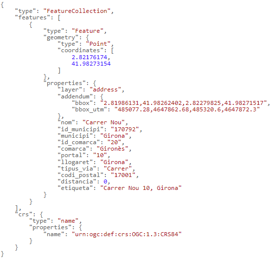

# 1.3 Geocodificació inversa
Para encontrar las direcciones y topónimos más próximos a un punto, hay que indicar sus coordenadas geográficas en los parámetros **lon** y **lat**.

Por ejemplo, indicando las coordenadas *2.82176174, 41.98273154*, obtenemos la dirección postal *Carrer Nou 10, Girona*:
[https://eines.icgc.cat/geocodificador/invers?**lon=2.82176174&lat=41.98273154**&size=1&layers=address](https://eines.icgc.cat/geocodificador/invers?lon=2.82176174&lat=41.98273154&size=1&layers=address){target="_blank"}

El resultado es:

