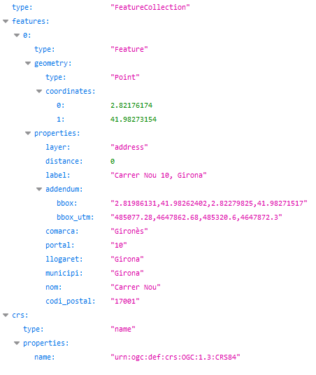

# 1.3 Geocodificació inversa
Per a trobar les adreces i topònims més propers a un punt, cal indicar les seves coordenades geogràfiques en els paràmetres **lon** i **lat**.

Per exemple, indicant les coordenades **2.82176174, 41.98273154**, obtenim l'adreça postal **Carrer Nou 10, Girona**:
[https://eines.icgc.cat/geocodificador/invers?**lon=2.82176174&lat=41.98273154**&size=1&layers=address](https://eines.icgc.cat/geocodificador/invers?lon=2.82176174&lat=41.98273154&size=1&layers=address){target="_blank"}

El resultat és:

