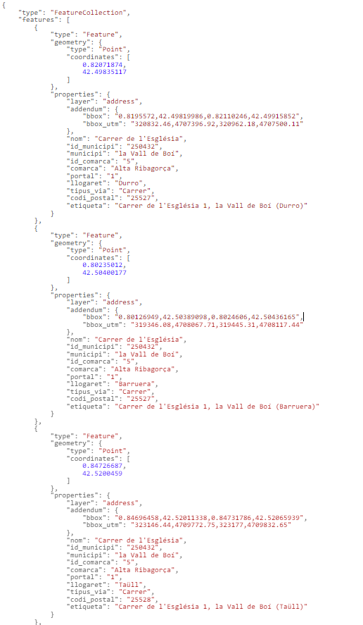

# 1.4 Obtener la aldea al que pertenece una dirección
Al buscar una dirección postal, podemos obtener la aldea o núcleo de población al que pertenece. Esta información aparece en el campo **llogaret** y al final del campo **label**, entre paréntesis.

Por ejemplo, al buscar la dirección **carrer de l'esglesia 1,la vall de boi**, obtenemos los 3 portales que hay en los núcleos de población de **Durro**, **Barruera** y **Taüll**, pertenecientes al municipio **la Vall de Boí**.
[https://eines.icgc.cat/geocodificador/autocompletar?text=*carre%20de%20l%27esglesia%201,la%20vall%20de%20boi*&layers=address&size=6](https://eines.icgc.cat/geocodificador/autocompletar?text=carrer%20de%20l%27esglesia%201,la%20vall%20de%20boi&layers=address&size=6){target="_blank"}

La respuesta es:

 