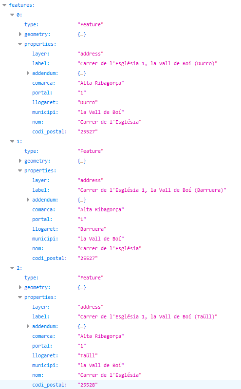

# 1.4 Obtenir el llogaret al que pertany una adreça
Al cercar una adreça postal, podem obtenir el llogaret o nucli de població al que pertany. Aquesta informació apareix al camp **llogaret** i al final del camp **label**, entre parèntesi.

Per exemple, al cercar l'adreça **carrer de l'esglesia 1,la vall de boi**, obtenim els 3 portals que hi ha als nuclis de població de **Durro**, **Barruera** i **Taüll**, pertanyents al municipi **la Vall de Boí**.
[https://eines.icgc.cat/geocodificador/autocompletar?text=**carrer%20de%20l%27esglesia%201,la%20vall%20de%20boi**&layers=address&size=6](https://eines.icgc.cat/geocodificador/autocompletar?text=carrer%20de%20l%27esglesia%201,la%20vall%20de%20boi&layers=address&size=6){target="_blank"}

La resposta és:

 