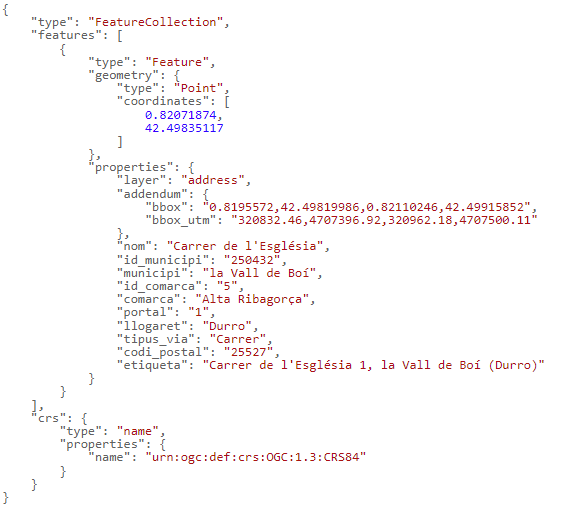

# 1.5 Buscar una dirección postal según la aldea
Es posible indicar el nombre de la aldea en la petición, en lugar del nombre de municipio. 

Por ejemplo, indicando **carrer de l'esglesia 1,durro**, restringimos la búsqueda al portal 1 de la calle Església de **Durro**, del municipio la Vall de Boí:

[https://eines.icgc.cat/geocodificador/autocompletar?text=*carrer%20de%20l%27esglesia%201,durro*&layers=address
](https://eines.icgc.cat/geocodificador/autocompletar?text=carrer%20de%20l%27esglesia%201,durro&layers=address){target="_blank"}

La respuesta es :

 