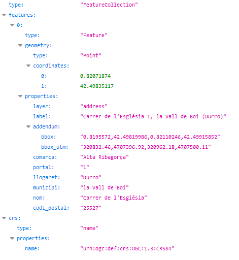

# 1.5 Cercar una adreça postal segons el llogaret
És possible indicar el nom del llogaret en la petició, en lloc del nom de municipi. 

Per exemple, indicant **carrer de l'esglesia 1,durro**, restringim la cerca al portal 1 del carrer Església de **Durro**, del municipi la Vall de Boí:

[https://eines.icgc.cat/geocodificador/autocompletar?text=**carrer%20de%20l%27esglesia%201,durro**&layers=address
](https://eines.icgc.cat/geocodificador/autocompletar?text=carrer%20de%20l%27esglesia%201,durro&layers=address){target="_blank"}

La resposta és :

 