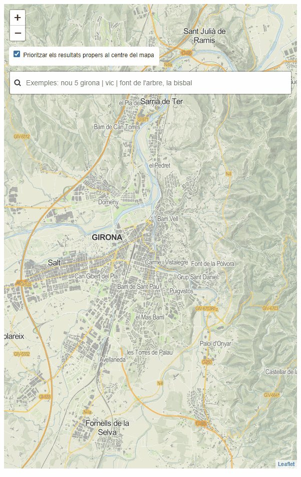

# 1.7 Prioritzar els resultats més propers a un punt
Al visor anterior [https://eines.icgc.cat/geocodificador_visor/
](https://eines.icgc.cat/geocodificador_visor/){target="_blank"} es pot activar la casella de priorització dels resultats més propers al centre del mapa, de manera que, si el mapa està centrat al municipi de Girona, en teclejar **Biblioteca** ens apareixen **biblioteques de Girona**.

Un exemple de petició és el següent, on s'indiquen les coordenades del punt central del mapa als paràmetres **focus.point.lat** i **focus.point.lon**: [https://eines.icgc.cat/geocodificador/autocompletar?text=bibli**&focus.point.lat=41.430371882652814**&**focus.point.lon=1.8539428710937502**&layers=topo1%2Ctopo2%2Caddress&size=5](https://eines.icgc.cat/geocodificador/autocompletar?text=bibli&focus.point.lat=41.430371882652814&focus.point.lon=1.8539428710937502&layers=topo1%2Ctopo2%2Caddress&size=5){target="_blank"}, on s'indica el text a cercar i el punt pel que es volen prioritzar les respostes
