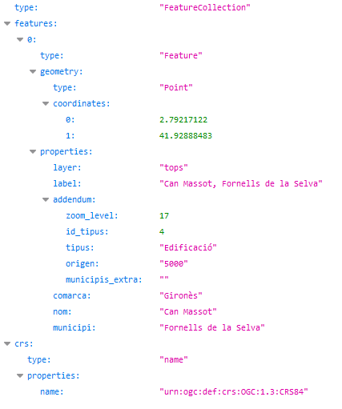

# 1.2 Cercar un topònim

Cal indicar el topònim a cercar en el paràmetre **text**.

Per exemple, indicant **can massot,fornells**, obtenim les coordenades geogràfiques del topònim **Can Massot, Fornells de la Selva**: 2.79217122, 41.92888483

[https://eines.icgc.cat/geocodificador/autocompletar?text=**can%C2%A0massot,fornells**&layers=tops&size=1](https://eines.icgc.cat/geocodificador/autocompletar?text=can%C2%A0massot,fornells&layers=tops&size=1)

El resultat és:

