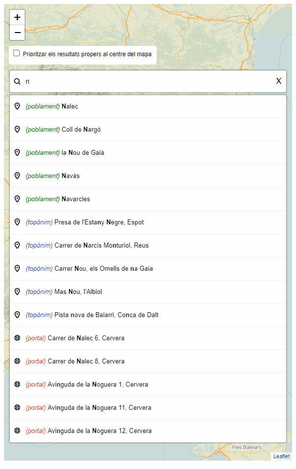

# 1.6 Integración en un visor Leaflet
A la imagen siguiente se muestra el visor [https://eines.icgc.cat/geocodificador_visor/](https://eines.icgc.cat/geocodificador_visor/){target="_blank"}, implementado con Leaflet, que contiene un buscador de'direcciones y topónimos y dónde a medida que el usuario va tecleando el texto a buscar, se envían peticiones al servicio de geocodificació, hasta encontrar el elemento deseado y su ubicación en el mapa.

Las peticiones enviadas utilizan la operación **autocompletar** con el parámetro *texto** conteniendo el texto introducido por el usuario. 

Un ejemplo de estas peticiones es [https://eines.icgc.cat/geocodificador/autocompletar?text=nou%203&layers=topo1%2Ctopo2%2Caddress&size=5](https://eines.icgc.cat/geocodificador/autocompletar?text=nou%203&layers=topo1%2Ctopo2%2Caddress&size=5){target="_blank"}

A [Visor con consultas al servicio Geocodificació ICGC](visor.md) se explica en detalle como acceder al visor y como se ha implementado.

