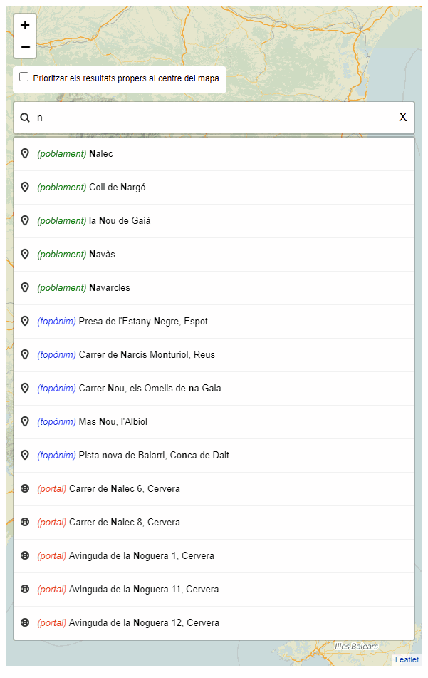

# 1.6 Integració en un visor Leaflet
A la imatge següent es mostra el visor [https://eines.icgc.cat/geocodificador_visor/](https://eines.icgc.cat/geocodificador_visor/){target="_blank"}, implementat amb Leaflet, que conté un cercador de'adreces i topònims i on a mesura que l'usuari va teclejant el text a cercar, s'envien peticions al servei de geocodificació, fins a trobar l'element desitjat i la seva ubicació al mapa.

Les peticions enviades utilitzen l'operació **autocompletar** amb el paràmetre **text** contenint el text introduït per l'usuari. 

Un exemple d'aquestes peticions és [https://eines.icgc.cat/geocodificador/autocompletar?text=nou%203&layers=topo1%2Ctopo2%2Caddress&size=5](https://eines.icgc.cat/geocodificador/autocompletar?text=nou%203&layers=topo1%2Ctopo2%2Caddress&size=5){target="_blank"}

A [Visor amb consultes al servei Geocodificació ICGC](visor.md) s'explica en detall com accedir al visor i com s'ha implementat.

Es pot descarregar de:  [https://github.com/OpenICGC/leaflet-geocodericgc-plugin](https://github.com/OpenICGC/leaflet-geocodericgc-plugin){target="_blank"} 
