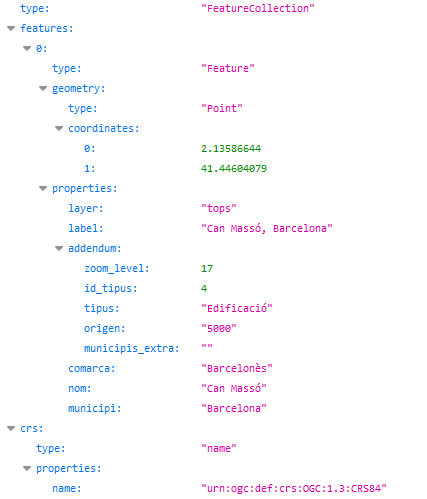

# Cerca autocompletar
 
URL de connexió: [https://eines.icgc.cat/geocodificador/autocompletar](https://eines.icgc.cat/geocodificador/autocompletar){target="_blank"} (GET)

## Descripció
L'operació **autocompletar** obté les dades i la ubicació d’una adreça o topònim sense necessitat de completar totes les dades d’identificació: a mesura que es va introduint el text a la caixa de cerca, s’envien peticions a **autocompletar**, amb la finalitat de trobar respostes de forma ràpida.

És imprescindible indicar el text a cercar en el paràmetre **text**.

El resultat s'obté en format GeoJSON.

En la integració en altres aplicacions, es recomana combinar **autocompletar** i **cerca**:

* a mesura que l'usuari va teclejant el text a cercar, enviar peticions a **autocompletar** , amb la finalitat de trobar respostes de forma ràpida. 
* un cop s'ha completat el text, si les respostes proporcionades per **autocompletar** no són suficients, es pot  prèmer la tecla [Intro] i fer una petició a l'operació de cerca completa.

Donat que les peticions a **autocompletar** generalment responen directament a l'entrada de text per part de l'usuari, cal tenir en compte la velocitat d'escriptura amb l'objectiu de no colapsar les peticions. 

També és necessari tenir en compte que les respostes poden ser asíncrones i no ser respostes en el mateix ordre en que es varen enviar.

Per a cercar les coordenades corresponents al topònim _can masso,barcelona_ cal fer la petició [https://eines.icgc.cat/geocodificador/autocompletar?text=can%20masso,barcelona&layers=tops&size=1](https://eines.icgc.cat/geocodificador/autocompletar?text=can%20masso,barcelona&layers=tops&size=1){target="_blank"}, que té la resposta: 

## Construcció de la consulta
La petició a l'API es construeix a partir de la URL **https://eines.icgc.cat/geocodificador/autocompletar**, seguida del signe **?** i de la seqüència de paràmetres, separats pel signe **&**.

Els paràmetres són els següents:

* **text**: conté el text a cercar. És un paràmetre obligatori.

    **És important tenir en compte que cal separar el nom del municipi amb una coma, de la manera següent:**

    - _nom_de_carrer portal, municipi_
        
    - _nom_edificació_aïllada, municipi_
    
    - _nom_topònim, municipi_

    Exemples: 

    - [https://eines.icgc.cat/geocodificador/autocompletar?text=nou 10,girona](https://eines.icgc.cat/geocodificador/autocompletar?text=nou 10,girona){target="_blank"}

    - [https://eines.icgc.cat/geocodificador/autocompletar?text=can riera,Vilademuls&layers=address](https://eines.icgc.cat/geocodificador/autocompletar?text=can riera,Vilademuls&layers=address){target="_blank"}

    - [https://eines.icgc.cat/geocodificador/autocompletar?text=montclar,riudecanyes](https://eines.icgc.cat/geocodificador/autocompletar?text=montclar,riudecanyes){target="_blank"}

* **layers**: s'utilitza per filtrar els tipus d'element a cercar 

    Es poden diferenciar els tipus de dades a cercar indicant el paràmetre **layers**, amb els valors següents:               

    . **address**: adreces postals

    . **tops**: tots els topònims

    . **topo_tipus_**_id_: topònims del tipus _id_, on _id_ és una cadena amb nombres entre 1 i 22, amb el 0 a l'esquerra pels menors de 10. Per exemple: **topo_tipus_01** per cercar _Caps de municipi_. La taula amb els tipus de topònim i els seus identificadors es pot consultar a [Taula topònims](tipusToponims.md){target="_blank"}

    Es poden indicar els valors següents per segregar els topònims en dos grups:

    . **topo1**: topònims referents a agrupacions de població (municipis, caps de municipi, entitats de població, disseminats i barris)

    . **topo2**: resta de topònims.

    Exemple, per trobar topònims amb el nom _Riera de Gaià_: [https://eines.icgc.cat/geocodificador/autocompletar?text=riera%20de%20gaia&layers=topo1,topo2](https://eines.icgc.cat/geocodificador/autocompletar?text=riera%20de%20gaia&layers=topo1,topo2){target="_blank"}

* **size**: s'utilitza per a definir el nombre màxim de resultats

    Per defecte, es retornen fins a 10 resultats de cada un dels tipus indicats a layers. Es pot indicar un nombre diferent amb el paràmetre **size**. El valor màxim és 40.

    Per exemple, per a trobar un únic topònim: [https://eines.icgc.cat/geocodificador/autocompletar?text=riera%20de%20gaia&layers=topo1&size=1](https://eines.icgc.cat/geocodificador/autocompletar?text=riera%20de%20gaia&layers=topo1&size=1){target="_blank"}

* **boundary.rect.min_lon**, **boundary.rect.min_lat**, **boundary.rect.max_lon** i **boundary.rect.max_lat**: per cercar en una àrea rectangular

    Es pot limitar espaialment la cerca indicant les coordenades latitud i longitud d'un rectangle amb aquests paràmetres.

    Exemple: [https://eines.icgc.cat/geocodificador/autocompletar?text=biblioteca&layers=topo1,topo2&size=300&boundary.rect.min_lon=2.790885602127&boundary.rect.min_lat=41.951744582496&boundary.rect.max_lon=2.847448636407&boundary.rect.max_lat=42.012358869945](https://eines.icgc.cat/geocodificador/autocompletar?text=biblioteca&layers=topo1,topo2&size=300&boundary.rect.min_lon=2.790885602127&boundary.rect.min_lat=41.951744582496&boundary.rect.max_lon=2.847448636407&boundary.rect.max_lat=42.012358869945){target="_blank"}

* **boundary.circle.lon**, **boundary.circle.lat**, **boundary.circle.radius**: per cercar en una àrea circular

    Es pot limitar espaialment la cerca indicant les coordenades d'un cercle amb els paràmetres **boundary.circle.lon** i **boundary.circle.lat**  (coordenada central de referència) i el paràmetre **boundary.circle.radius** (radi en km).

    Exemple: [https://eines.icgc.cat/geocodificador/autocompletar?text=biblioteca&layers=topo1,topo2&size=5&boundary.circle.lon=2.815683&boundary.circle.lat=41.976216&boundary.circle.radius=3](https://eines.icgc.cat/geocodificador/autocompletar?text=biblioteca&layers=topo1,topo2&size=5&boundary.circle.lon=2.815683&boundary.circle.lat=41.976216&boundary.circle.radius=3){target="_blank"}

* **focus.point.lat**, **focus.point.lon**: priorització de resultats per proximitat

    Per prioritzar els resultats més propers a unes coordenades cal indicar-les amb aquests paràmetres.

    Exemple: [http://localhost:3300/autocompletar?text=biblioteca&focus.point.lat=41.972509114053196&focus.point.lon=2.828636169433594&layers=topo1%2Ctopo2&size=5](http://localhost:3300/autocompletar?text=biblioteca&focus.point.lat=41.972509114053196&focus.point.lon=2.828636169433594&layers=topo1%2Ctopo2&size=5){target="_blank"}

* **com**: per filtrar per comarca

    El paràmetre **com** permet especificar el nom de la comarca o el seu identificador. 

    Es pot consultar el llistat de comarques a [Taula de comarques](https://www.idescat.cat/codis/?id=50&n=10){target="_blank"}

    Exemples: 

    [https://eines.icgc.cat/geocodificador/autocompletar?text=biblioteca&com=girones](https://eines.icgc.cat/geocodificador/autocompletar?text=biblioteca&com=girones){target="_blank"} (indicant el nom de comarca)

    [https://eines.icgc.cat/geocodificador/autocompletar?text=biblioteca&com=20](https://eines.icgc.cat/geocodificador/autocompletar?text=biblioteca&com=20){target="_blank"}  (indicant identificador de comarca)

* **mun**: per filtrar per municipi

    El paràmetre **mun** permet especificar el nom del municipi o el seu identificador. 

    Es pot consultar el llistat de municipis a [Taula de municipis](https://www.idescat.cat/codis/?id=50&n=9){target="_blank"}

    Exemples:
    
    [https://eines.icgc.cat/geocodificador/autocompletar?text=biblioteca&mun=girona](https://eines.icgc.cat/geocodificador/autocompletar?text=biblioteca&mun=girona){target="_blank"}  (indicant el nom de municipi)

    [https://eines.icgc.cat/geocodificador/autocompletar?text=biblioteca&mun=170792](https://eines.icgc.cat/geocodificador/autocompletar?text=biblioteca&mun=170792){target="_blank"} (indicant identificador de municipi)

## Paràmetres d'entrada

| Paràmetre      | Tipus                          | Obligatori | Descripció | Valor per defecte	| Exemple |
| ----------- | ------------------------------------ |---|--|--|--|
| **text** |cadena de text	| Si| Text a cercar| | Riera de Sallent|
| **focus.point.lat**	 |número de punt flotant	| No| Latitud del punt pel que es volen prioritzar els resultats  | | 41.430371882652814|
| **focus.point.lon**	 |número de punt flotant	| No| Longitud del punt pel que es volen prioritzar els resultats | | 1.8566894531250002|
| **layers** |cadena de text	| No| Tipus d’elements a cercar: [address, tops, _topo_tipus_id_, topo1, topo2]| topo1,topo2,address	| address,topo1|
| **size** |enter		| No| Nombre de resultats. El màxim és 40|10 | 5|
| **com** |cadena de text	| No| Identificador d'una comarca, dins la que es vol restringir la cerca| | 01|
| **mun** |cadena de text	| No| Identificador d'un municipi, dins la que es vol restringir la cerca|| 080018|
| **boundary.circle.lat**	|número de punt flotant	| No| Latitud del punt del cercle de cerca  | | 41.430371882652814|
| **boundary.circle.lon**	|número de punt flotant	| No| Longitud  del punt del cercle de cerca  | | 2.81233|
| **boundary.circle.radius**	|número de punt flotant	| No| radi del cercle de cerca (km) | | 10|
| **boundary.rect.min_lat**	|número de punt flotant	| No| Latitud de l'extrem inferior del rectangle de cerca | | 41.909303728668824|
| **boundary.rect.min_lon**	|número de punt flotant	| No| Longitud de l'extrem inferior del rectangle de cerca | | 2.694053649902344|
| **boundary.rect.max_lat**	|número de punt flotant	| No| Latitud de l'extrem superior del rectangle de cerca | | 42.01142264969458|
| **boundary.rect.max_lon**	|número de punt flotant	| No| Longitud de l'extrem superior del rectangle de cerca | | 2.911033630371094|

## Paràmetres de sortida
Es retornen els resultats en format GeoJSON.

L'element **features.properties** té els camps descrits a la taula següent:

| Camp      | Descripció | Aplicacble als elements |
| ----------- | ------------------------------------ |---|
| **layer** |Tipus d'element trobat.Els valors possibles són els indicats al paràmetre layers d'entrada | Tots|
| **etiqueta** |Agregació de camps. Per adreces: carrer portal, municipi (llogaret). _Nota: Si el llogaret coincideix amb el municipi, no s'indica_. Per topònims: topònim, municipi | Tots|
| **municipi** | Municipi. En alguns topònims , no hi ha un municipi assignat i pren el valor "-"| Tots|
| **comarca** | Comarca. En alguns topònims , no hi ha una comarca assignada i pren el valor "-"| Adreces|
| **llogaret** | Llogaret| Adreces|
| **portal** |Portal de l'adreça | Adreces|
| **nom** |Nom del carrer, de l'edificació aïllada o de topònim | Tots|
| **codi_postal** |Codi postal  | Adreces|
| **distancia** |Distància en quilòmetres al punt indicat amb els camps _focus.point.lat, focus.point.lon_  | Tots|
| **addendum.origen** |Escala origen | Topònims|
| **addendum.zoom** | Nivell de zoom òptim| Topònims|
| **addendum.tipus** | Tipus de topònim| Topònims|
| **addendum.id_tipus** | Identificador tipus de  topònim	| Topònims|
| **addendum.municipis_extra** |Resta de municipis assignats	 | Topònims|
| **addendum.bbox** |Coordenades geogràfiques del rectangle contenidor del carrer	 | Adreces|
| **addendum.bbox_utm** |Coordenades UTM del rectangle contenidor del carrer	 | Adreces|

## Exemples de sortida segons tipus de layer
|Adreça postal|
|---|
|[https://eines.icgc.cat/geocodificador/autocompletar?text=nou%2010%20girona&layers=address&size=1](  https://eines.icgc.cat/geocodificador/autocompletar?text=nou%2010%20girona&layers=address&size=1 ){target="_blank"}
|

|Topònim|
|---|
|[https://eines.icgc.cat/geocodificador/autocompletar?text=Barranc%20de%20Barball&layers=tops&size=1](https://eines.icgc.cat/geocodificador/autocompletar?text=Barranc%20de%20Barball&layers=tops&size=1   ){target="_blank"}
|

