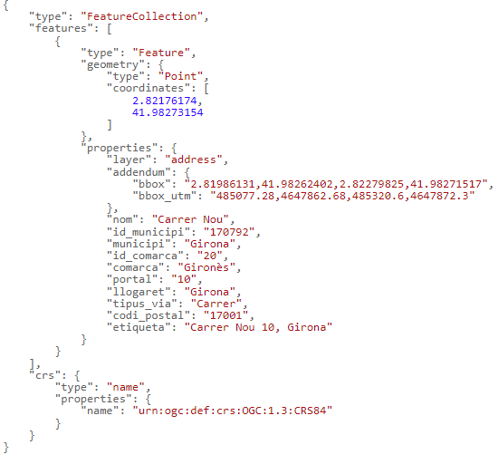

# Búsqueda indicando la dirección completa
 
#URL de conexión: [https://eines.icgc.cat/geocodificador/cerca](https://eines.icgc.cat/geocodificador/cerca){target="_blank"} (GET)

## Descripción
La operación **cerca** (Geocodificación directa o búsqueda completa) devuelve los datos y la ubicación de una dirección o topónimo, indicados de forma completa.

Es imprescindible indicar el texto a buscar en el parámetro **text**.

El resultado se obtiene en formato GeoJSON.

Por ejemplo, para buscar las coordenadas correspondientes a la dirección _carrer nou 10,girona_, hay que hacer la petición [https://eines.icgc.cat/geocodificador/cerca?text=carrer nou 10,girona&layers=address&size=1](https://eines.icgc.cat/geocodificador/cerca?text=carrer nou 10,girona&layers=address&size=1){target="_blank"}, que tiene la respuesta: 

## Construcción de la consulta
La petición al API se construye a partir de la #URL **https://eines.icgc.cat/geocodificador/cerca**, seguida del signo *?* y de la secuencia de parámetros, separados por el signo **&**.

Los parámetros son los siguientes:

* **text**: contiene el texto a buscar. Es un parámetro obligatorio.

      *Es importante tener en cuenta que, en el caso de búsqueda de direcciones postales, hay que separar el nombre del municipio o de la aldea con una coma, de la manera siguiente:*

    - _nombre_de_calle portal, municipio/aldea_
        
    - _nombre_edificación_aislada, municipio/aldea_

    - _nombre_topónimo, municipio_

    Ejemplos: 
    
    - [https://eines.icgc.cat/geocodificador/cerca?text=nou 10,girona&layers=address](https://eines.icgc.cat/geocodificador/cerca?text=nou 10,girona&layers=address){target="_blank"}

    - [https://eines.icgc.cat/geocodificador/cerca?text=can riera,Vilademuls&layers=topo2](https://eines.icgc.cat/geocodificador/cerca?text=can riera,Vilademuls&layers=topo2){target="_blank"}
    
    - [https://eines.icgc.cat/geocodificador/cerca?text=montclar,riudecanyes&layers=topo1](https://eines.icgc.cat/geocodificador/cerca?text=montclar,riudecanyes&layers=topo1){target="_blank"}

* **layers**: se utiliza para filtrar los tipos de elemento a buscar 

    Se pueden diferenciar los tipos de datos a buscar indicando el parámetro **layers**, con los valores siguientes:               

    . **address**: direcciones postales

    . **tops**: todos los topónimos

    . *topo_tipo_*_id_: topónimos del tipo _id_, donde _id_ es una cadena con números entre 1 y 22, con el 0 a la izquierda por los menores de 10. Por ejemplo: *topo_tipo_01** para buscar _Cabezas de municipio_. La tabla con los tipos de topónimo y sus identificadores se puede consultar en [Tabla topónimos](tipustoponims.md){target="_blank"}

    Se pueden indicar los valores siguientes para segregar los topónimos en dos grupos:

    . **topo1**: topónimos referentes a agrupaciones de población (municipios, cabezas de municipio, entidades de población, diseminados y barrios)

    . **topo2**: resto de topónimos.

    Ejemplo, para encontrar topónimos con el nombre _Riera de Gaià_: [https://eines.icgc.cat/geocodificador/cerca?text=riera%20de%20gaia&layers=topo1,topo2](https://eines.icgc.cat/geocodificador/cerca?text=riera%20de%20gaia&layers=topo1,topo2){target="_blank"}

* **size**: se utiliza para definir el número máximo de resultados

    Por defecto, se devuelven hasta 10 resultados de cada uno de los tipos indicados en layers. Se puede indicar un número diferente con el parámetro **size**. El valor máximo es 40.

    Por ejemplo, para encontrar un único topónimo: [https://eines.icgc.cat/geocodificador/cerca?text=riera%20de%20gaia&layers=topo1&size=1](https://eines.icgc.cat/geocodificador/cerca?text=riera%20de%20gaia&layers=topo1&size=1){target="_blank"}

* **boundary.rect.min_lon**, **boundary.rect.min_lat**, **boundary.rect.max_lon** y **boundary.rect.max_lat**: para buscar en una área rectangular

    Se puede limitar espacialmente la búsqueda indicando las coordenadas latitud y longitud de un rectángulo con estos parámetros.

    Ejemplo: [https://eines.icgc.cat/geocodificador/cerca?text=biblioteca&layers=topo1,topo2&size=300&boundary.rect.min_lon=2.790885602127&boundary.rect.min_lat=41.951744582496&boundary.rect.max_lon=2.847448636407&boundary.rect.max_lat=42.012358869945](https://eines.icgc.cat/geocodificador/cerca?text=biblioteca&layers=topo1,topo2&size=300&boundary.rect.min_lon=2.790885602127&boundary.rect.min_lat=41.951744582496&boundary.rect.max_lon=2.847448636407&boundary.rect.max_lat=42.012358869945){target="_blank"}

* **boundary.circle.lon**, **boundary.circle.lat**, **boundary.circle.radius**: para buscar en una área circular

    Se puede limitar espacialmente la búsqueda indicando las coordenadas de un círculo con los parámetros **boundary.circle.lon** y **boundary.circle.lat**  (coordenada central de referencia) y el parámetro **boundary.circle.radius** (radio en #km).

    Ejemplo: [https://eines.icgc.cat/geocodificador/cerca?text=biblioteca&layers=topo1,topo2&size=5&boundary.circle.lon=2.815683&boundary.circle.lat=41.976216&boundary.circle.radius=3](https://eines.icgc.cat/geocodificador/cerca?text=biblioteca&layers=topo1,topo2&size=5&boundary.circle.lon=2.815683&boundary.circle.lat=41.976216&boundary.circle.radius=3){target="_blank"}

* **focus.point.lat**, **focus.point.lon**: priorización de resultados por proximidad

    Para priorizar los resultados más próximos a unas coordenadas hay que indicarlas con estos parámetros.

    Ejemplo: [https://eines.icgc.cat/geocodificador/cerca?text=biblioteca&focus.point.lat=41.972509114053196&focus.point.lon=2.828636169433594&layers=topo1%2Ctopo2&size=5](https://eines.icgc.cat/geocodificador/cerca?text=biblioteca&focus.point.lat=41.972509114053196&focus.point.lon=2.828636169433594&layers=topo1%2Ctopo2&size=5){target="_blank"}

* **com**: para filtrar por comarca

    El parámetro **com** permite especificar el nombre de la comarca o su identificador. 

    Se puede consultar el listado de comarcas en [Tabla de comarcas](https://www.idescat.cat/codis/?id=50&n=10&lang=es){target="_blank"}

    Ejemplos: 

    [https://eines.icgc.cat/geocodificador/cerca?text=biblioteca&com=girones](https://eines.icgc.cat/geocodificador/cerca?text=biblioteca&com=girones){target="_blank"} (indicando el nombre de comarca)

    [https://eines.icgc.cat/geocodificador/cerca?text=biblioteca&com=20](https://eines.icgc.cat/geocodificador/cerca?text=biblioteca&com=20){target="_blank"}  (indicando identificador de comarca)

* **mun**: para filtrar por municipio

    El parámetro **mun** permite especificar el nombre del municipio o su identificador. 

    Se puede consultar el listado de municipios en [Tabla de municipios](https://www.idescat.cat/codis/?id=50&n=9&lang=es){target="_blank"}

    Ejemplos:
    
    [https://eines.icgc.cat/geocodificador/cerca?text=biblioteca&mun=girona](https://eines.icgc.cat/geocodificador/cerca?text=biblioteca&mun=girona){target="_blank"}  (indicando el nombre de municipio)

    [https://eines.icgc.cat/geocodificador/cerca?text=biblioteca&mun=170792](https://eines.icgc.cat/geocodificador/cerca?text=biblioteca&mun=170792){target="_blank"} (indicando identificador de municipio)

## Parámetros de entrada

| Parámetro      | Tipo                          | Obligatorio | Descripción | Valor por defecto	| Ejemplo |
| ----------- | ------------------------------------ |---|--|--|--|
| **text** |cadena de texto	| Si| Texto a buscar| | Riera de Sallent|
| **focus.point.lat**	 |número de punto flotante	| No| Latitud del punto por el que se quieren priorizar los resultados  | | 41.430371882652814|
| **focus.point.lon**	 |número de punto flotante	| No| Longitud del punto por el que se quieren priorizar los resultados | | 1.8566894531250002|
| **layers** |cadena de texto	| No| Tipo de elementos a buscar: [address, tops, _topo_tipo_id_, topo1, topo2]| topo1,topo2,address	| address,topo1|
| **size** |entero		| No| Número de resultados. El máximo es 40|10 | 5|
| **com** |cadena de texto	| No| Identificador de una comarca, dentro de la que se quiere restringir la búsqueda| | 01|
| **mun** |cadena de texto	| No| Identificador de un municipio, dentro de la que se quiere restringir la búsqueda|| 080018|
| **boundary.circle.lat**	|número de punto flotante	| No| Latitud del punto del círculo de búsqueda  | | 41.430371882652814|
| **boundary.circle.lon**	|número de punto flotante	| No| Longitud  del punto del círculo de búsqueda  | | 2.81233|
| **boundary.circle.radius**	|número de punto flotante	| No| radio del círculo de búsqueda (#km) | | 10|
| **boundary.rect.min_lat**	|número de punto flotante	| No| Latitud del extremo inferior del rectángulo de búsqueda | | 41.909303728668824|
| **boundary.rect.min_lon**	|número de punto flotante	| No| Longitud del extremo inferior del rectángulo de búsqueda | | 2.694053649902344|
| **boundary.rect.max_lat**	|número de punto flotante	| No| Latitud del extremo superior del rectángulo de búsqueda | | 42.01142264969458|
| **boundary.rect.max_lon**	|número de punto flotante	| No| Longitud del extremo superior del rectángulo de búsqueda | | 2.911033630371094|

## Parámetros de salida
Se devuelven los resultados en formato GeoJSON.

El elemento **features.properties** tiene los campos descritos a la tabla siguiente:

| Campo      | Descripción | Aplicacble a los elementos |
| ----------- | ------------------------------------ |---|
| **layer** |Tipo de elemento encontrado.Los valores posibles son los indicados en el parámetro _layers_ de entrada | Todos|
| **etiqueta** |Agregación de campos. Para direcciones: calle portal, municipio (aldea). _Nota: Si la aldea coincide con el municipio, no se indica_. Par topónimos: topónimo, municipio | Todos|
| **municipi** | Municipio. En algunos topónimos, no hay un municipio asignado y toma el valor "-"| Todos|
| **comarca** | Comarca. En algunos topónimos, no hay una comarca asignada y toma el valor "-"| Direcciones|
| **llogaret** | Aldea| Direcciones|
| **portal** |Portal de la dirección | Direcciones|
| **nom** |Nombre de la calle, de la edificación aislada o del topónimo | Todos|
| **codi_postal** |Código postal  | Direcciones|
| **distancia** |Distancia en kilómetros al punto indicado con los campos _focus.point.lat, focus.point.lon_  | Todos|
| **addendum.origen** |Escala origen | Topónimos|
| **addendum.zoom** | Nivel de zoom óptimo| Topónimos|
| **addendum.tipus** | Tipo de topónimo| Topónimos|
| **addendum.id_tipus** | Identificador tipo de topónimo	| Topónimos|
| **addendum.municipis_extra** |Resto de municipios asignados	 | Topónimos|
| **addendum.bbox** |Coordenadas geográficas del rectángulo contenedor de la calle	 | Direcciones|
| **addendum.bbox_utm** |Coordenadas UTM del rectángulo contenedor de la calle	 | Direcciones|

## Ejemplos de salida según tipo de layer
|Dirección postal|
|---|
|[https://eines.icgc.cat/geocodificador/cerca?text=nou%2010%20girona&layers=address&size=1](  https://eines.icgc.cat/geocodificador/cerca?text=nou%2010%20girona&layers=address&size=1 ){target="_blank"}
|

|Topónimo|
|---|
|[https://eines.icgc.cat/geocodificador/cerca?text=barranc%20de%20Barball&layers=tops&size=1](https://eines.icgc.cat/geocodificador/cerca?text=barranc%20de%20Barball&layers=tops&size=1   ){target="_blank"}
|
