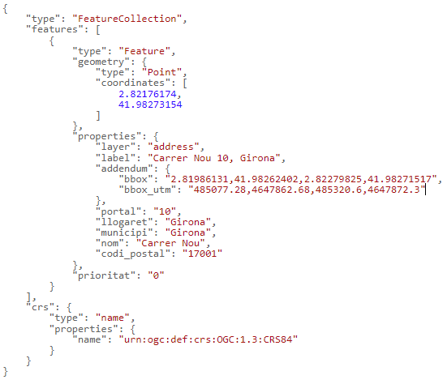

# Cerca indicant l'adreça completa
 
URL de connexió: [https://eines.icgc.cat/geocodificador/cerca](https://eines.icgc.cat/geocodificador/cerca) (GET)

## Descripció
L'operació **cerca** (Geocodificació directa o cerca completa) retorna les dades i la ubicació d’una adreça o topònim, indicats de forma completa.

És imprescindible indicar el text a cercar en el paràmetre **text**.

El resultat s'obté en format GeoJSON.

Per a cercar les coordenades corresponents a l'adreça _nou 10,girona_ podem fer la petició [https://eines.icgc.cat/geocodificador/cerca?text=nou 10,girona&layers=address&size=1](https://eines.icgc.cat/geocodificador/cerca??text=nou 10,girona&layers=address&size=1) que té la resposta: 

## Construcció de la consulta
La petició a l'API es construeix a partir de la URL **https://eines.icgc.cat/geocodificador/cerca**, seguit del signe **?** i de la seqüència de paràmetres, separats pel signe **&**.

Els paràmetres són els següents:

* **text**: conté el text a cercar. És un paràmetre obligatori.

    És important tenir en compte que, en el cas de cerca d'adreces postals, cal separar el portal i el nom del municipi amb una coma, seguint el format: _nom_de_carrer portal, municipi_

    Exemple: [https://eines.icgc.cat/geocodificador/cerca?text=nou 10,girona&layers=address&size=1](https://eines.icgc.cat/geocodificador/cerca??text=nou 10,girona&layers=address&size=1)

* **layers**: s'utilitza per filtrar els tipus d'element a cercar 

    Es poden diferenciar els tipus de dades a cercar indicant el paràmetre _layers_, amb els valors següents:               

    . **address**: adreces postals

    . **tops**: tots els topònims

    . **topo_tipus_**_id_: topònims del tipus _id_, on _id_ és una cadena amb nombres entre 1 i 22, amb el 0 a l'esquerra pels menors de 10. Per exemple: **topo_tipus_01** per cercar _Caps de municipi_. La taula amb els tipus de topònim i els seus identificadors es pot consultar a [Taula topònims](tipusToponims.md)

    Es poden indicar els valors següents per segregar els topònims en dos grups:

    . **topo1**: topònims referents a agrupacions de població (municipis, caps de municipi, entitats de població, disseminats i barris)

    . **topo2**: resta de topònims.

    Exemple, per trobar topònims amb el nom _Riera de Gaià_: [https://eines.icgc.cat/geocodificador/cerca?text=riera%20de%20gaia&layers=topo1,topo2](https://eines.icgc.cat/geocodificador/cerca?text=riera%20de%20gaia&layers=topo1,topo2)

* **size**: s'utilitza per a definir el nombre màxim de resultats

    Per defecte, es retornen fins a 10 resultats de cada un dels tipus indicats a layers. Es pot indicar un nombre diferent amb el paràmetre size. El valor màxim és 40.

    Per exemple, per a trobar un únic topònim: [https://eines.icgc.cat/geocodificador/cerca?text=riera%20de%20gaia&layers=topo1&size=1](https://eines.icgc.cat/geocodificador/cerca?text=riera%20de%20gaia&layers=topo1&size=1)

* **boundary.rect.min_lon**, **boundary.rect.min_lat**, **boundary.rect.max_lon** i **boundary.rect.max_lat**: per cercar en una àrea rectangular

    Es pot limitar espaialment la cerca indicant les coordenades latitud i longitud d'un rectangle amb aquests paràmetres.

    Exemple: [https://eines.icgc.cat/geocodificador/cerca?text=biblioteca&layers=topo1,topo2&size=300&boundary.rect.min_lon=2.790885602127&boundary.rect.min_lat=41.951744582496&boundary.rect.max_lon=2.847448636407&boundary.rect.max_lat=42.012358869945](https://eines.icgc.cat/geocodificador/cerca?text=biblioteca&layers=topo1,topo2&size=300&boundary.rect.min_lon=2.790885602127&boundary.rect.min_lat=41.951744582496&boundary.rect.max_lon=2.847448636407&boundary.rect.max_lat=42.012358869945)

* **boundary.circle.lon**, **boundary.circle.lat**, **boundary.circle.radius**: per cercar en una àrea circular

    Es pot limitar espaialment la cerca indicant les coordenades d'un cercle amb els paràmetres **boundary.circle.lon** i **boundary.circle.lat**  (coordenada central de referència) i el paràmetre **boundary.circle.radius** (radi en km).

    Exemple: [https://eines.icgc.cat/geocodificador/cerca?text=biblioteca&layers=topo1,topo2&size=5&boundary.circle.lon=2.815683&boundary.circle.lat=41.976216&boundary.circle.radius=3](https://eines.icgc.cat/geocodificador/cerca?text=biblioteca&layers=topo1,topo2&size=5&boundary.circle.lon=2.815683&boundary.circle.lat=41.976216&boundary.circle.radius=3)

* **focus.point.lat**, **focus.point.lon**: priorització de resultats per proximitat

    Per prioritzar els resultats més propers a unes coordenades cal indicar-les amb aquests paràmetres.

    Exemple: [http://localhost:3300/cerca?text=biblioteca&focus.point.lat=41.972509114053196&focus.point.lon=2.828636169433594&layers=topo1%2Ctopo2&size=5](http://localhost:3300/cerca?text=biblioteca&focus.point.lat=41.972509114053196&focus.point.lon=2.828636169433594&layers=topo1%2Ctopo2&size=5)

* **com**: per filtrar per comarca

    El paràmetre **com** permet especificar el nom de la comarca o el seu identificador. 

    Es pot consultar el llistat de comarques a [https://www.idescat.cat/codis/?id=50&n=10](https://www.idescat.cat/codis/?id=50&n=10)

    Exemples: 

    [https://eines.icgc.cat/geocodificador/cerca?text=biblioteca&com=girones](https://eines.icgc.cat/geocodificador/cerca?text=biblioteca&com=girones) (indicant el nom de comarca)

    [https://eines.icgc.cat/geocodificador/cerca?text=biblioteca&mun=20](https://eines.icgc.cat/geocodificador/cerca?text=biblioteca&mun=20)  (indicant identificador de comarca)

* **mun**: per filtrar per municipi

    El paràmetre mun permet especificar el nom del municipi o el seu identificador. 

    Es pot consultar el llistat de municipis a [https://www.idescat.cat/codis/?id=50&n=9](https://www.idescat.cat/codis/?id=50&n=9)

    Exemples:
    
    [https://eines.icgc.cat/geocodificador/cerca?text=biblioteca&mun=girona](https://eines.icgc.cat/geocodificador/cerca?text=biblioteca&mun=girona)  (indicant el nom de municipi)

    [https://eines.icgc.cat/geocodificador/cerca?text=biblioteca&mun=170792](https://eines.icgc.cat/geocodificador/cerca?text=biblioteca&mun=170792) (indicant identificador de municipi)

## Paràmetres d'entrada

| Paràmetre      | Tipus                          | Obligatori | Descripció | Valor per defecte	| Exemple |
| ----------- | ------------------------------------ |---|--|--|--|
| text |cadena de text	| Si| Text a cercar| | Riera de Sallent|
| focus.point.lat	 |número de punt flotant	| No| Latitud del punt pel que es volen prioritzar els resultats  | | 41.430371882652814|
| focus.point.lon	 |número de punt flotant	| No| Longitud del punt pel que es volen prioritzar els resultats | | 1.8566894531250002|
| layers |cadena de text	| No| Tipus d’elements a cercar: [address, tops, topo_tipus_id, topo1, topo2]| topo1,topo2,address	| address,topo1|
| com |cadena de text	| No| Identificador d'una comarca, dins la que vol restringir la cerca|cap | 01|
| mun |cadena de text	| No| Identificador d'un municipi, dins la que vol restringir la cerca|cap | 080018|
|boundary.circle.lat	|número de punt flotant	| No| Latitud del punt del cercle de cerca  | | 41.430371882652814|
|boundary.circle.lon	|número de punt flotant	| No| Longitud  del punt del cercle de cerca  | | 2.81233|
|boundary.circle.radius	|número de punt flotant	| No| radi del cercle de cerca (km) | | 10|
|boundary.rect.min_lat	|número de punt flotant	| No| Latitud de l'extrem inferior del rectangle de cerca | | 41.909303728668824|
|boundary.rect.min_lon	|número de punt flotant	| No| Longitud de l'extrem inferior del rectangle de cerca | | 2.694053649902344|
|boundary.rect.max_lat	|número de punt flotant	| No| Latitud de l'extrem superior del rectangle de cerca | | 42.01142264969458|
|boundary.rect.max_lon	|número de punt flotant	| No| Longitud de l'extrem superior del rectangle de cerca | | 2.911033630371094|

## Paràmetres de sortida
Es retornen els resultats en format GeoJSON.

L'element **features.properties** té els camps descrits a la taula següent:

| Camp      | Descripció | Aplicacble als elements |
| ----------- | ------------------------------------ |---|
| layer |Tipus d'element trobat.Els valors possibles són els indicats al paràmetre layers d'entrada | Tots|
| label |Agregació de camps: carrer portal, municipi (per adreces) , topònim,municipi (per topònims) | Tots|
| municipi | Municipi. En alguns topònims , no hi ha un municipi assignat i pren el valor "-"| Tots|
| comarca | Comarca. En alguns topònims , no hi ha una comarca assignada i pren el valor "-"| Adreces|
| llogaret | llogaret| Adreces|
| portal |Portal de l'adreça | Adreces|
| nom |Nom del carrer, e l'edificació aïllada o de topònim | Tots|
| codi_postal | | Adreces|
| addendum.origen |Escala origen | Topònims|
| addendum.zoom_level | Nivell de zoom òptim| Topònims|
| addendum.tipus | Tipus de topònim| Topònims|
| addendum.id_tipus | Identificador tipus de  topònim	| Topònims|
| addendum.municipis_extra |Resta de municipis assignats	 | Topònims|
| addendum.bbox |Coordenades geogràfiques del rectangle contenidor del carrer	 | Adreces|
| addendum.bbox_utm |Coordenades UTM del rectangle contenidor del carrer	 | Adreces|

## Exemples de sortida segons tipus de layer
|Adreça postal|
|---|
|[https://eines.icgc.cat/geocodificador/cerca?text=nou%2010%20girona&layers=address&size=1](  https://eines.icgc.cat/geocodificador/cerca?text=nou%2010%20girona&layers=address&size=1 )
|

|Topònim|
|---|
|[https://eines.icgc.cat/geocodificador/cerca?text=Barranc%20de%20Barball&layers=tops&size=1](https://eines.icgc.cat/geocodificador/cerca?text=Barranc%20de%20Barball&layers=tops&size=1   )
|

