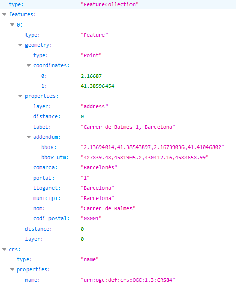

# Cerca inversa
 
URL de connexió: [https://eines.icgc.cat/geocodificador/invers](https://eines.icgc.cat/geocodificador/invers){target="_blank"} (GET)

## Descripció
L'operació **invers** (geocodificació inversa) cerca les adreces i topònims més propers a un punt geogràfic determinat, especificat per la seva latitud i longitud.

El resultat s'obté en format GeoJSON.

Per exemple, per a cercar l'adreça més propera a les coordenades _41.385965, 2.16687_, cal fer la petició [https://eines.icgc.cat/geocodificador/invers?lat=41.385965&lon=2.16687&size=1&layers=address](https://eines.icgc.cat/geocodificador/invers?lat=41.385965&lon=2.16687&size=1&layers=address){target="_blank"}, que té la resposta: 

## Construcció de la consulta
La petició a l'API es construeix a partir de la URL **https://eines.icgc.cat/geocodificador/invers**, seguida del signe **?** i de la seqüència de paràmetres, separats pel signe **&**.

Els paràmetres són els següents:

* **lon**, **lat**: són obligatoris i contenen les coordenades del punt geogràfic al voltant del qual es vol fer la cerca.

    Exemple: [http://eines.icgc.cat/geocodificador/invers?lon=0.20949814&lat=41.12599206 ](http://eines.icgc.cat/geocodificador/invers?lon=0.20949814&lat=41.12599206 ){target="_blank"}

* **boundary.circle.radius**: indica el radi del cercle de cerca (en km).

    Exemple: [http://eines.icgc.cat/geocodificador/invers?lon=0.20949814&lat=41.12599206&layers=tops&size=10&boundary.circle.radius=0.4](http://eines.icgc.cat/geocodificador/invers?lon=0.20949814&lat=41.12599206&layers=tops&size=10&boundary.circle.radius=0.4){target="_blank"}

* **layers**: s'utilitza per filtrar els tipus d'element a cercar 

    Es poden diferenciar els tipus de dades a cercar indicant el paràmetre **layers**, amb els valors següents:               

    . **address**: adreces postals

    . **tops**: tots els topònims

    . **topo_tipus_**_id_: topònims del tipus _id_, on _id_ és una cadena amb nombres entre 1 i 22, amb el 0 a l'esquerra pels menors de 10. Per exemple: **topo_tipus_01** per cercar _Caps de municipi_. La taula amb els tipus de topònim i els seus identificadors es pot consultar a [Taula topònims](tipusToponims.md){target="_blank"}

    Es poden indicar els valors següents per segregar els topònims en dos grups:

    . **topo1**: topònims referents a agrupacions de població (municipis, caps de municipi, entitats de població, disseminats i barris)

    . **topo2**: resta de topònims.

    Exemple, per trobar topònims: [http://eines.icgc.cat/geocodificador/invers?lon=0.20949814&lat=41.12599206&layers=tops](http://eines.icgc.cat/geocodificador/invers?lon=0.20949814&lat=41.12599206&layers=tops){target="_blank"}

* **size**: s'utilitza per a definir el nombre màxim de resultats

    Per defecte, es retornen fins a 10 resultats de cada un dels tipus indicats a layers. Es pot indicar un nombre diferent amb el paràmetre **size**. El valor màxim és 40.

    Per exemple, per a trobar un únic topònim: [http://eines.icgc.cat/geocodificador/invers?lon=0.20949814&lat=41.12599206&layers=tops&size=1](http://eines.icgc.cat/geocodificador/invers?lon=0.20949814&lat=41.12599206&layers=tops&size=1){target="_blank"}

* **com**: per filtrar per comarca

    Permet especificar el nom de la comarca o el seu identificador. 

    Es pot consultar el llistat de comarques a [Taula de comarques](https://www.idescat.cat/codis/?id=50&n=10){target="_blank"}

    Exemples: 
     [https://eines.icgc.cat/geocodificador/invers?lon=2.094256&lat=41.432308&layers=tops&size=10&com=barcelones](https://eines.icgc.cat/geocodificador/invers?lon=2.094256&lat=41.432308&layers=tops&size=10&com=barcelones){target="_blank"}    (indicant el nom de comarca)

     [https://eines.icgc.cat/geocodificador/invers?lon=2.094256&lat=41.432308&layers=tops&size=10&com=13](https://eines.icgc.cat/geocodificador/invers?lon=2.094256&lat=41.432308&layers=tops&size=10&com=13){target="_blank"}   (indicant identificador de comarca)

* **mun**: per filtrar per municipi

    Permet especificar el nom del municipi o el seu identificador. 

    Es pot consultar el llistat de municipis a [Taula de municipis](https://www.idescat.cat/codis/?id=50&n=9){target="_blank"}

    Exemples:
    
    [https://eines.icgc.cat/geocodificador/invers?lon=2.094256&lat=41.432308&layers=tops&size=10&mun=barcelona](https://eines.icgc.cat/geocodificador/invers?lon=2.094256&lat=41.432308&layers=tops&size=10&mun=barcelona){target="_blank"}  (indicant el nom de municipi)

    [ https://eines.icgc.cat/geocodificador/invers?lon=2.094256&lat=41.432308&layers=tops&size=10&mun=080193]( https://eines.icgc.cat/geocodificador/invers?lon=2.094256&lat=41.432308&layers=tops&size=10&mun=080193){target="_blank"} (indicant identificador de municipi)

## Paràmetres d'entrada

| Paràmetre      | Tipus                          | Obligatori | Descripció | Valor per defecte	| Exemple |
| ----------- | ------------------------------------ |---|--|--|--|
| **lat** |número de punt flotant		| Si| latitud| | 41.385965|
| **lon** |número de punt flotant		| Si| longitud| | | lat |número de punt flotant		| Si| latitud| | 41.385965||
|**boundary.circle.radius**	|número de punt flotant	| No| radi del cercle de cerca (km) | 1| 0.5|
| **layers** |cadena de text	| No| Tipus d’elements a cercar: [address, tops, _topo_tipus_id_, topo1, topo2]| topo1,topo2,address	| address,topo1|
| **size** |enter		| No| Nombre de resultats. El màxim és 40|10 | 5|
| **com** |cadena de text	| No| Identificador d'una comarca, dins la que vol restringir la cerca|cap | 01|
| **mun** |cadena de text	| No| Identificador d'un municipi, dins la que vol restringir la cerca|cap | 080018|

## Paràmetres de sortida
Es retornen els resultats en format GeoJSON.

L'element **features.properties** té els camps descrits a la taula següent:

| Camp      | Descripció | Aplicacble als elements |
| ----------- | ------------------------------------ |---|
| **layer** |Tipus d'element trobat.Els valors possibles són els indicats al paràmetre layers d'entrada | Tots|
| **distancia** |Distància en quilòmetres de l'element trobat al punt indicat	| Tots|
| **etiqueta** |Agregació de camps. Per adreces: carrer portal, municipi (llogaret). _Nota: Si el llogaret coincideix amb el municipi, no s'indica_. Per topònims: topònim, municipi | Tots|
| **municipi** | Municipi. En alguns topònims , no hi ha un municipi assignat i pren el valor "-"| Tots|
| **comarca** | Comarca. En alguns topònims , no hi ha una comarca assignada i pren el valor "-"| Adreces|
| **llogaret** | Llogaret| Adreces|
| **portal** |Portal de l'adreça | Adreces|
| **nom** |Nom del carrer, de l'edificació aïllada o de topònim | Tots|
| **codi_postal** |Codi postal  | Adreces|
| **addendum.origen** |Escala origen | Topònims|
| **addendum.zoom** | Nivell de zoom òptim| Topònims|
| **addendum.tipus** | Tipus de topònim| Topònims|
| **addendum.id_tipus** | Identificador tipus de  topònim	| Topònims|
| **addendum.municipis_extra** |Resta de municipis assignats	 | Topònims|
| **addendum.bbox** |Coordenades geogràfiques del rectangle contenidor del carrer	 | Adreces|
| **addendum.bbox_utm** |Coordenades UTM del rectangle contenidor del carrer	 | Adreces|

## Exemples de sortida segons tipus de layer
|Adreça postal|
|---|
|[https://eines.icgc.cat/geocodificador/invers?lon=2.13798&lat=41.4271&layers=address&size=1](https://eines.icgc.cat/geocodificador/invers?lon=2.13798&lat=41.4271&layers=address&size=1){target="_blank"}
|

|Topònim|
|---|
|[https://eines.icgc.cat/geocodificador/invers?lon=0.20949814&lat=41.12599206&layers=tops&size=1](https://eines.icgc.cat/geocodificador/invers?lon=0.20949814&lat=41.12599206&layers=tops&size=1){target="_blank"}
|

