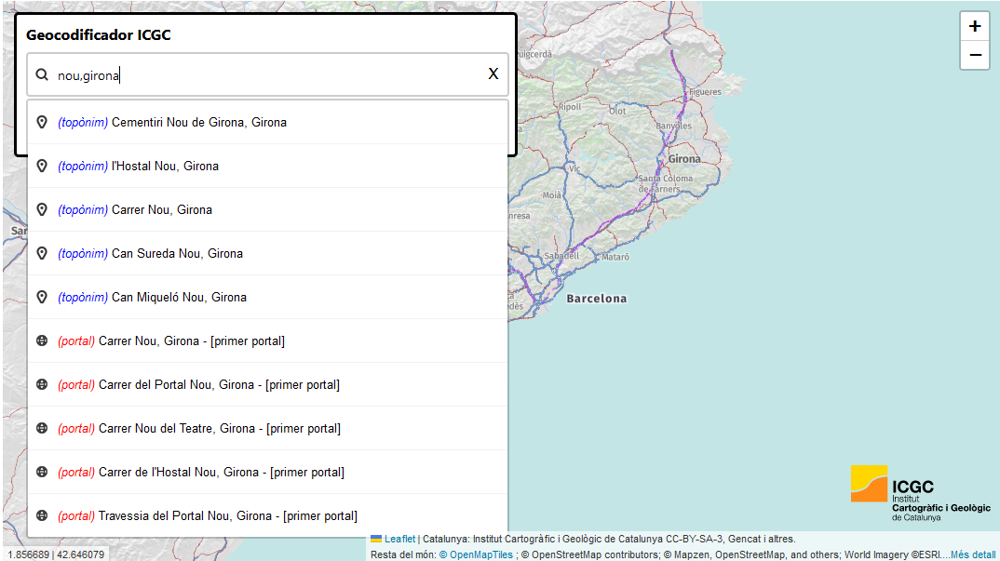
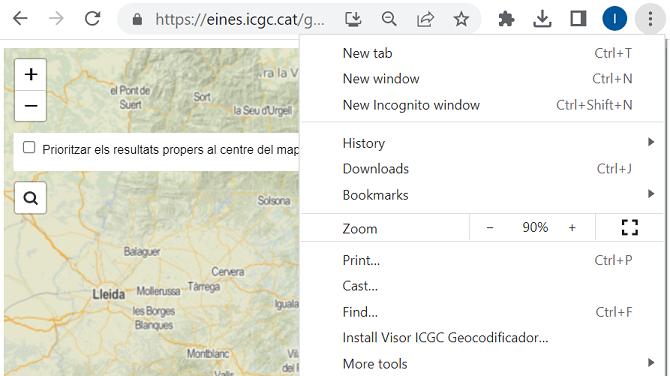

# 1.6 Visor de mapas con consultas al Geocodificador ICGC

El visor [https://eines.icgc.cat/geocodificador_visor/](https://eines.icgc.cat/geocodificador_visor/){target="_blank"} es un ejemplo de uso del geocodificador ICGC, con peticiones de geocodificació directa e inversa.



## Geocodificación directa

Contiene un buscador de direcciones y topónimos: a medida que el usuario va tecleando el texto a buscar, se envían peticiones al servicio de geocodificació directa, hasta encontrar el elemento deseado y su ubicación en el mapa.

!!! noto " "

    Las peticiones enviadas utilizan la operación **autocompletar** con el parámetro **text** conteniendo el texto introducido por el usuario. 
    
    Un ejemplo de estas peticiones es [https://eines.icgc.cat/geocodificador/autocompletar?*text=nou%203*&layers=topo1%2Ctopo2%2Caddress&size=5](https://eines.icgc.cat/geocodificador/autocompletar?text=nou%203&layers=topo1%2Ctopo2%2Caddress&size=5){target="_blank"}


## Geocodificación inversa

Al hacer clic sobre el mapa, se hace una petición de geocodificació inversa, obteniendo la dirección postal y el topónimo más próximos al punto indicado en un radio de 500 metros.

!!! noto " "

    Las peticiones enviadas utilizan la operación **invers** con los parámetros **lon** y **lat** conteniendo el punto marcado por el usuario. 
    
    Un ejemplo de estas peticiones es [https://eines.icgc.cat/geocodificador/invers?*lat=41.81623479875584*&*lon=2.4224853515625004*&size=1&boundary.circle.radius=0.5&layers=topo2,address](https://eines.icgc.cat/geocodificador/invers?lat=41.81623479875584&lon=2.4224853515625004&size=1&boundary.circle.radius=0.5&layers=topo2,address){target="_blank"}


## Priorización de resultados

Si la casilla **Priorizar los resultados próximos al centro del mapa** está activada, en la lista de resultados se muestran primero los resultados más próximos al centro del mapa.

!!! noto " "

    El punto central del mapa se indica en los parámetros **focus.point.lat** y **focus.point.lon**. 
    
    Un ejemplo de petición es  [https://eines.icgc.cat/geocodificador/autocompletar?text=biblioteca*&focus.point.lat=41.97952806717199&focus.point.lon=2.8178000450134277*&layers=topo1%2Ctopo2%2Caddress&size=5](https://eines.icgc.cat/geocodificador/autocompletar?text=biblioteca&focus.point.lat=41.97952806717199&focus.point.lon=2.8178000450134277&layers=topo1%2Ctopo2%2Caddress&size=5){target="_blank"}


## Tipo de elementos a buscar

Los elementos buscados pertenecen a una de las siguientes capas (indicadas en el parámetro **layers*):

* **topo1**: topónimos de poblamiento o agrupaciones de población (nombre de municipio, capital de municipio, entidad de población, diseminado, barrio), mostrando en primer lugar los topónimos que son nombre de municipio o capital de municipio.
Aparecen en la lista de resultados con el prefijo <span style="color:green">(poblament)</span>.

* **topo2**: resto de topónimos.
Aparecen en la lista de resultados con el prefijo <span style="color:blue">(topònim)</span>.

* **address**: portales.
Aparecen en la lista de resultados con el prefijo <span style="color:red">(portal)</span>.

## Número máximo de resultados

El parámetro **size** se ha asignado a 5, para mostrar como máximo 5 elementos de cada una de las capas.

## Consulta del tipo de topónimos

Al situar el cursor sobre un elemento encontrado de las capas **topo1** o **topo2**, se muestra el tipo de topónimo (campo **addendum.tipus**):


## Descarga

Se puede descargar de:  [https://github.com/openicgc/leaflet-geocodericgc-plugin](https://github.com/openicgc/leaflet-geocodericgc-plugin){target="_blank"} 

## Implementación 

Se ha implementado con la librería **Leaflet**, utilizando el plugin *leaflet-geocoder-mapzen*.

Se utiliza el plugin *leaflet-geocoder-mapzen* [https://www.npmjs.com/package/leaflet-geocoder-mapzen](https://www.npmjs.com/package/leaflet-geocoder-mapzen){target="_blank"}, que se ha modificado para gestionar los parámetros **size** y **focus**, el prefijo y tooltip de cada resultado (campo **addendum.tipus** en caso de los topónimos) y el nivel de zoom del mapa (campo **addendum.zoom** en caso de los topónimos)


``` js
<!-- Cargar codigo Leaflet del cdn -->
<link rel="stylesheet" href="https://cdnjs.cloudflare.com/ajax/libs/leaflet/1.0.3/leaflet.css">
<script src="https://cdnjs.cloudflare.com/ajax/libs/leaflet/1.0.3/leaflet.js"></script>
 
<!-- Cargar plugin Leaflet de geocodificación mapzen-->
<script src="js/leaflet-geocoder.js"></script>
 
// Crear el mapa
var map = L.map('map', {
        center: [41.431, 1.8580],
        zoom: 8,
        minZoom: 2,
        maxZoom: 18,
        scrollWheelZoom: true,
        zoomControl: false
      });

var geocodingOptions = {
        url: 'https://eines.icgc.cat/geocodificador',
        expanded: true,
        autocomplete: true,
        layers: "topo1,topo2,address",
        size: 5,
        foco: false,
        panToPoint: true
      };
      geoc
L.control.geocoder(geocodingOptions).addTo(map);
```

## Código para incrustar el visor
Para insertar el visor en vuestro web, copiar y pegar el texto siguiente:
``` { .html .copy }
<iframe width="100%" height="500" frameborder="0" scrolling="no" marginheight="0" marginwidth="0" src="https://eines.icgc.cat/geocodificador_visor/" ></iframe>
```

## Funcionalidad PWA
El visor Leaflet [https://eines.icgc.cat/geocodificador_visor/](https://eines.icgc.cat/geocodificador_visor/){target="_blank"} es una aplicación web progresiva (PWA) que presenta la posibilidad de ser descargada e iniciada desde la pantalla principal o el menú de aplicaciones de cualquier dispositivo con un navegador web.

Para instalar la aplicación, en Chrome:

**Windows** 



**Android** 


