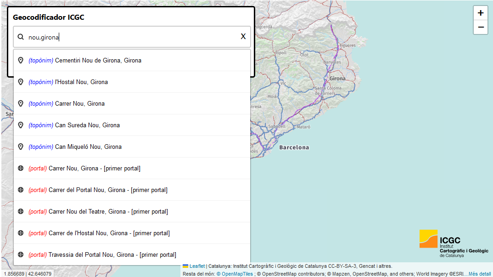
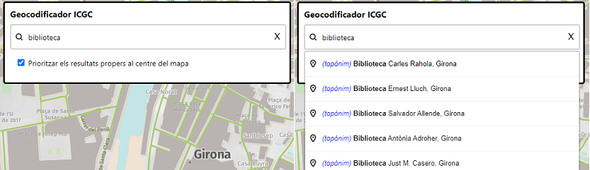
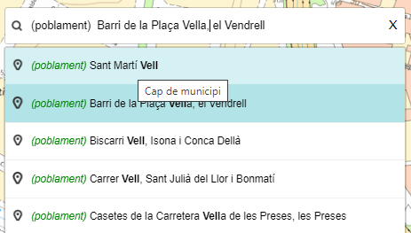
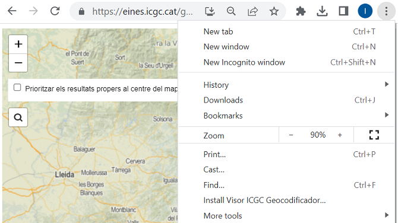
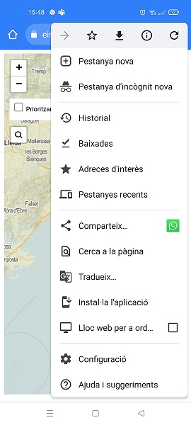

# 1.6 Visor de mapes amb consultes al Geocodificador ICGC

El visor [https://eines.icgc.cat/geocodificador_visor/](https://eines.icgc.cat/geocodificador_visor/){target="_blank"} és un exemple d'ús del geocodificador ICGC, amb peticions de geocodificació directa i inversa.



## Geocodificació directa

Conté un cercador d'adreces i topònims: a mesura que l'usuari va teclejant el text a cercar, s'envien peticions al servei de geocodificació directa, fins a trobar l'element desitjat i la seva ubicació al mapa.

!!! note " "

    Les peticions enviades utilitzen l'operació **autocompletar** amb el paràmetre **text** contenint el text introduït per l'usuari. 
    
    Un exemple d'aquestes peticions és [https://eines.icgc.cat/geocodificador/autocompletar?**text=nou%203**&layers=topo1%2Ctopo2%2Caddress&size=5](https://eines.icgc.cat/geocodificador/autocompletar?text=nou%203&layers=topo1%2Ctopo2%2Caddress&size=5){target="_blank"}


## Geocodificació inversa

Al fer clic sobre el mapa, es fa una petició de geocodificació inversa, obtenint l'adreca postal i el topònim més propers al punt indicat en un radi de 500 metres.

!!! note " "

    Les peticions enviades utilitzen l'operació **invers** amb els paràmetres **lon** i **lat** contenint el punt marcat per l'usuari. 
    
    Un exemple d'aquestes peticions és [https://eines.icgc.cat/geocodificador/invers?**lat=41.81623479875584**&**lon=2.4224853515625004**&size=1&boundary.circle.radius=0.5&layers=topo2,address](https://eines.icgc.cat/geocodificador/invers?lat=41.81623479875584&lon=2.4224853515625004&size=1&boundary.circle.radius=0.5&layers=topo2,address){target="_blank"}


## Priorització de resultats

Si la casella **Prioritzar els resultats propers al centre del mapa** està activada, a la llista de resultats es mostren primer els resultats més propers al centre del mapa.

!!! note " "

    El punt central del mapa s'indica als paràmetres **focus.point.lat** i **focus.point.lon**. 
    
    Un exemple de petició és  [https://eines.icgc.cat/geocodificador/autocompletar?text=biblioteca**&focus.point.lat=41.97952806717199&focus.point.lon=2.8178000450134277**&layers=topo1%2Ctopo2%2Caddress&size=5](https://eines.icgc.cat/geocodificador/autocompletar?text=biblioteca&focus.point.lat=41.97952806717199&focus.point.lon=2.8178000450134277&layers=topo1%2Ctopo2%2Caddress&size=5){target="_blank"}



## Tipus d'elements a cercar

Els elements cercats pertanyen a una de les següents capes (indicades al paràmetre **layers**):

* **topo1**: topònims de poblament o agrupacions de població (nom de municipi, cap de municipi, entitat de població, disseminat, barri), mostrant en primer lloc els topònims que són nom de municipi o cap de municipi.
Apareixen a la llista de resultats amb el prefix <span style="color:green">(poblament)</span>.

* **topo2**: resta de topònims.
Apareixen a la llista de resultats amb el prefix <span style="color:blue">(topònim)</span>.

* **address**: portals.
Apareixen a la llista de resultats amb el prefix <span style="color:red">(portal)</span>.

## Nombre màxim de resultats

El paràmetre **size** s'ha assignat a 5, per mostrar com a màxim 5 elements de cada una de les capes.

## Consulta del tipus de topònims

Al situar el cursor sobre un element trobat de les capes **topo1** o **topo2**, es mostra el tipus de topònim (camp **addendum.tipus**):



## Descàrrega

Es pot descarregar de:  [https://github.com/OpenICGC/leaflet-geocodericgc-plugin](https://github.com/OpenICGC/leaflet-geocodericgc-plugin){target="_blank"} 

## Implementació 

S'ha implementat amb la llibreria **Leaflet**, utilitzant el plugin *leaflet-geocoder-mapzen*.

S’utilitza el plugin *leaflet-geocoder-mapzen* [https://www.npmjs.com/package/leaflet-geocoder-mapzen](https://www.npmjs.com/package/leaflet-geocoder-mapzen){target="_blank"}, que s’ha modificat per gestionar els paràmetres **size** i **focus**, el prefix i tooltip de cada resultat (camp **addendum.tipus** en cas dels topònims) i el nivell de zoom del mapa (camp **addendum.zoom** en cas dels topònims)


``` js
<!-- Carregar codi Leaflet del cdn -->
<link rel="stylesheet" href="https://cdnjs.cloudflare.com/ajax/libs/leaflet/1.0.3/leaflet.css">
<script src="https://cdnjs.cloudflare.com/ajax/libs/leaflet/1.0.3/leaflet.js"></script>
 
<!-- Carregar plugin Leaflet de geocodificació mapzen-->
<script src="js/leaflet-geocoder.js"></script>
 
// Crear el mapa
var map = L.map('map', {
        center: [41.431, 1.8580],
        zoom: 8,
        minZoom: 2,
        maxZoom: 18,
        scrollWheelZoom: true,
        zoomControl: false
      });

var geocodingOptions = {
        url: 'https://eines.icgc.cat/geocodificador',
        expanded: true,
        autocomplete: true,
        layers: "topo1,topo2,address",
        size: 5,
        focus: false,
        panToPoint: true
      };
      geoc
L.control.geocoder(geocodingOptions).addTo(map);
```

## Codi per a incrustar el visor
Per inserir el visor al vostre web, copieu i enganxeu el text següent:
``` { .html .copy }
<iframe width="100%" height="500" frameborder="0" scrolling="no" marginheight="0" marginwidth="0" src="https://eines.icgc.cat/geocodificador_visor/" ></iframe>
```

## Funcionalitat PWA
El visor Leaflet [https://eines.icgc.cat/geocodificador_visor/](https://eines.icgc.cat/geocodificador_visor/){target="_blank"} és una aplicació web progressiva (PWA) que presenta la possibilitat de ser baixada i iniciada des de la pantalla principal o el menú d'aplicacions de qualsevol dispositiu amb un navegador web.

Per instal·lar l'aplicació, a Chrome:
<div class="grid cards" markdown>

- **Windows** 
- 
- **Android** 
- 

</div>

